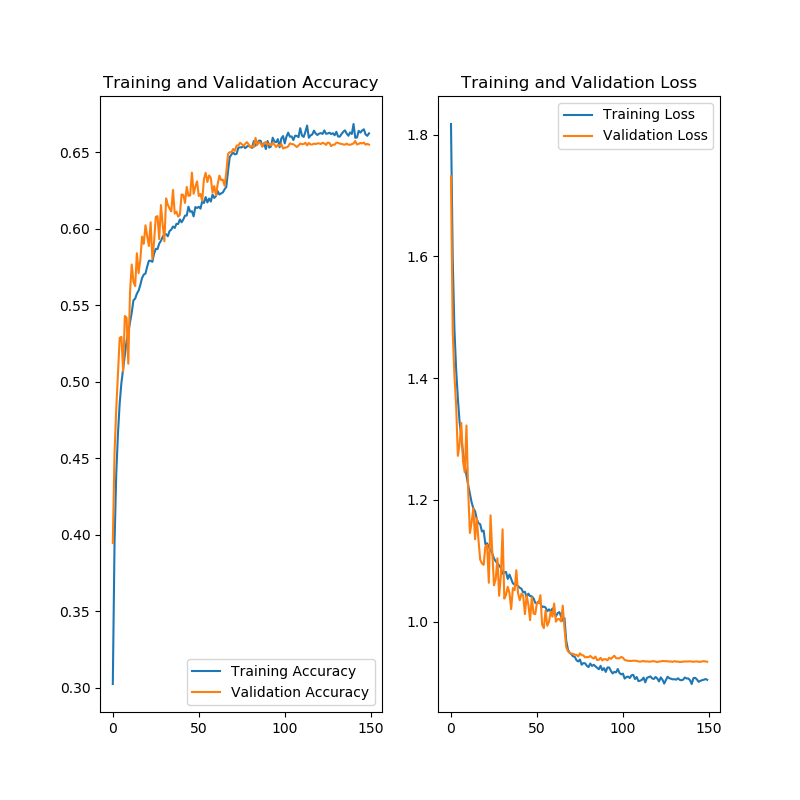
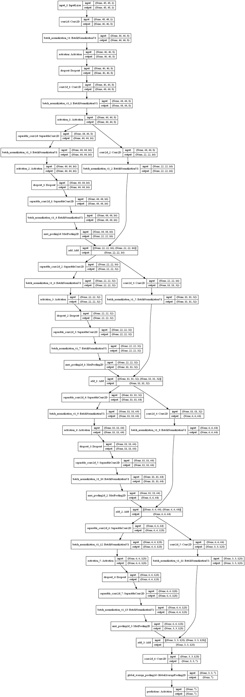

# Emotion detection model

This folder contains resources for training and testing a Convolutional Neural Network (CNN) for detecting emotions in color photos. 

## Training the Model

1. To train this model, you'll need to [download the `fer2013` dataset from Kaggle](https://www.kaggle.com/c/challenges-in-representation-learning-facial-expression-recognition-challenge/data). Unpack the Tarball and place the directory in the same directory as `train.py`.

2. Install dependencies

```bash
pip3 install tensorflow
pip3 install pandas
pip3 install numpy
pip3 install opencv-python
pip3 install pillow
pip3 install sklearn
pip3 install matplotlib
pip3 install imutils
```

3. Run `python3 train.py` in a terminal. If you're running on a local machine, the default number of epochs (110) will take a LONG time to run.

As the model trains, output models will be created in the `models` directory with the format `_mini_XCEPTION.{EPOCH #}-{ACCURACY %}.hdf5`. 

4. Once the training is complete, you can take the model with the highest accuracy and use it for testing. In my own iterations training, accuracy tended to cap out around 66%, as illustrated in the result graphs below.



To tweak the model for subsequent runs, you can change the model architecture, modify parameters or the ImageDataGenerator features (lines 62-80).

```python
# parameters
batch_size = 32
num_epochs = 110
input_shape = (48, 48, 1)
verbose = 1
num_classes = 7
patience = 50
base_path = 'models/'
l2_regularization = 0.01
dropout = 0.1

# data generator
data_generator = ImageDataGenerator(
    featurewise_center=False,
    featurewise_std_normalization=False,
    rotation_range=10,
    width_shift_range=0.1,
    height_shift_range=0.1,
    zoom_range=.1,
    horizontal_flip=True)
```

## Testing the Model

1. To test the model, open the `predict.py` file and add a reference to the desired model file on line 12, and the path to an image to test with on line 13.

2. Run `python3 predict.py` in a terminal session. The model will make an emotion inference, draw it on a copy o the photo and save it with the name `{originalImageName}_prediction.png`

## Building a TensorFlow Lite Model for Google Coral (or Equivalent SBC)

## Appendix. Model Architecture Overview

